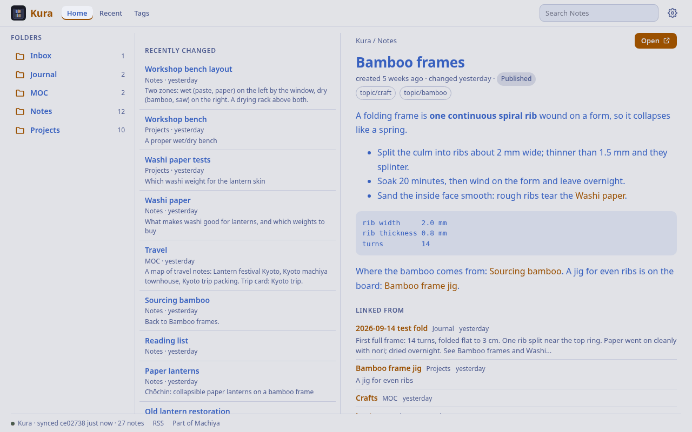
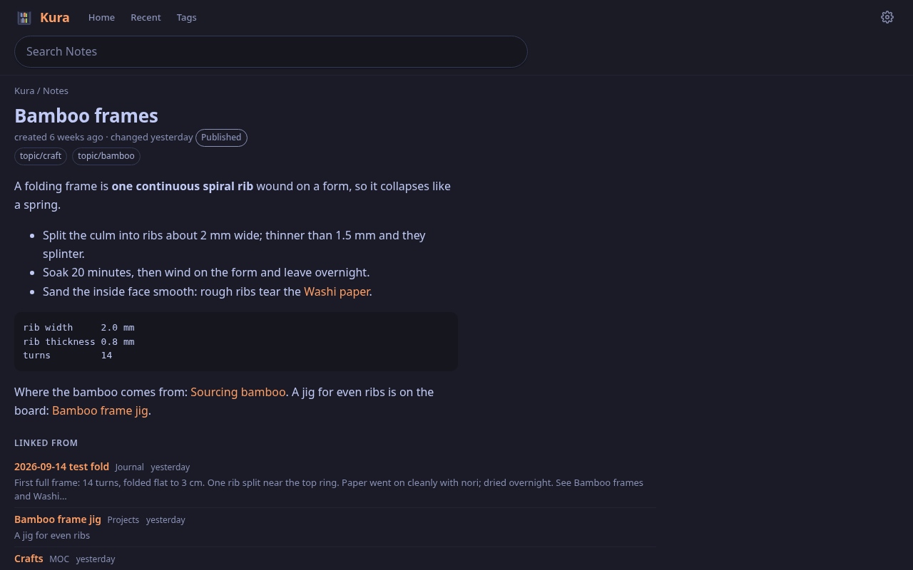
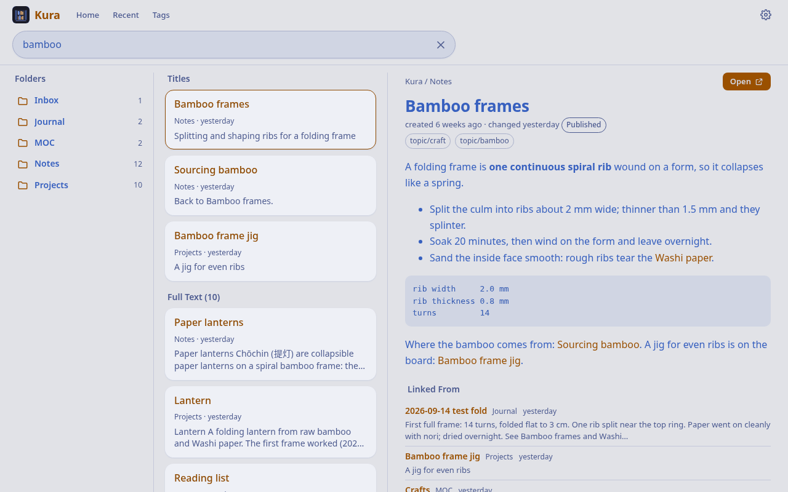
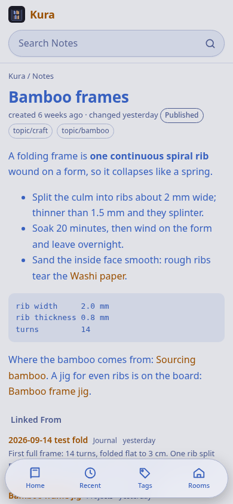

# Kura 蔵

**Every note in the vault, with working links, full-text search and a JSON API.** Kura (the storehouse) is part of [Machiya](https://github.com/machiya-kobo/machiya). It's the vault's web home, where every note link lands, and the note source for Shiori.

**Machiya** is a set of small self-hosted apps around one Obsidian vault; each app is a **room** (Kura is the room that reads and searches every note), and the rooms share one look and one set of settings. The **owner** is the person whose vault it is, the only one Kura serves. The Machiya repository has the architecture, the principles and the API contract.

- A reader with three columns on wide screens (folders | notes | preview), two on tablets, and one plus a tab bar on phones. It's the room `kura` (蔵, orange) in Machiya's shared shell: Tokyo Night / Day, the Rooms switcher, a footer status line and `/settings` (Appearance; Reading: Preview Pane, Obsidian Vault, Offline Copies; Apps; About).
- **Other vaults.** With `KURA_VAULTS`, more vaults (say `work`, `client` or `team`) are readable and searchable next to the default one: the default lives at `/n/…` as always, every other vault at `/v/<name>/…` with a vault chip and a switch in the header. A vault is **private** unless it's marked `+shared`: a yellow chip, never pushed to Hister, never stored on a device (`Cache-Control: no-store`, network-only in the service worker), no external links and no feed. A **shared** vault is treated like the default one at its `/v/<name>/` addresses: kept for offline reading (`offline: true` counts), external links, its own `/v/<name>/feed.xml`, pushed to Hister. Neither gets Niwa or Konbini links (those rooms read the default vault only), and both stay invisible to the API unless a client asks with `vault=`. See "Vaults" in the API contract.
- Installable as a PWA with offline reading: the shared service worker keeps the 200 notes read last, and every note with `offline: true` for good (listed at `/api/offline`, fetched ahead). Pages under `Archive/` answer `Cache-Control: no-store` and are never kept on a device.
- Every `[[wikilink]]` works, with backlinks from the whole vault, folder and tag browsing (nested tags included), and recently changed.
- Full-text search (SQLite FTS5): phrases, `-exclusions`, `prefix*`, `title:`, `tag:`, `folder:`, ranked by bm25 with titles first.
- A JSON API for Shiori and anything else: `/api/search`, `/api/notes`, `/api/note` (with `external_links`, the note body's http, https, gemini and gopher links), `/api/links` (a folder's external links in one call, never for a private vault), `/api/recent`, `/api/tags`, `/api/folders`, `/api/status`, plus `/feed.xml`. The contract is `docs/contracts/kura-api.md` in the Machiya repository.

## Quickstart

Two ways to try Kura: **alone** with the sample vault in `sample-vault/` (A), or **as part of the Machiya stack** (B). The
standalone path needs no account, no network service and no Tailscale: Kura listens on `127.0.0.1` with the identity
check off (`KURA_AUTH=open`), which is for a demo on your own machine only.

### A. Standalone

You need `git` and `curl`, and either **a container engine** (Docker or Podman; tested with Podman 5.4) or **Python 3.13**
with `markdown` 3.7 or later and `pyyaml` (below, for Debian, OpenBSD, FreeBSD and NetBSD). Start in a clone of this repository:

```sh
git clone https://github.com/machiya-kobo/kura.git
cd kura
```

Kura reads a git repository. The sample vault is a plain folder of Markdown notes (a fictional paper-lantern workshop and a
trip to Kyoto, 27 notes), so both ways below start by turning a copy of it into a repository.

#### A1. With a container (Docker or Podman)

If you have neither, on Debian 13 install `podman` (and `catatonit`, the small init program that `--init` uses with podman):

<!-- quickstart: container-debian:packages -->
```bash
sudo apt-get update
sudo apt-get install -y git curl podman catatonit
```

Say which engine you use (the rest of this section runs `$DOCKER`):

<!-- quickstart: container-docker:engine -->
```bash
DOCKER=docker
```

*or, with Podman:* `--cgroup-manager=cgroupfs` keeps podman from needing a systemd user session, which a freshly set-up or
ssh-only machine may not have yet.

<!-- quickstart: container-podman:engine -->
```bash
DOCKER="podman --cgroup-manager=cgroupfs"
```

Then make the sample vault a repository and start Kura:

<!-- quickstart: container:vault -->
```bash
cp -R sample-vault/personal vault
git -C vault init -q -b main
git -C vault add -A
git -C vault -c user.name=Demo -c user.email=demo@example.com commit -q -m "sample vault"
```

<!-- quickstart: container:run -->
```bash
$DOCKER build -t kura app
$DOCKER run -d --init --name kura -p 127.0.0.1:8080:8080 \
  -v "$PWD/vault:/vault:ro" -v kura-data:/data \
  -e KURA_REPO_DIR=/vault -e KURA_AUTH=open \
  -e GIT_CONFIG_COUNT=1 -e GIT_CONFIG_KEY_0=safe.directory -e GIT_CONFIG_VALUE_0='*' \
  kura
```

The three `GIT_CONFIG_*` settings tell git that the mounted vault, which belongs to your user, is safe to read; `--init` makes
`stop` quick. Wait until Kura has read the vault, then check it:

<!-- quickstart: container:check -->
```bash
for i in $(seq 60); do curl -s http://127.0.0.1:8080/api/status | grep -q '"ready": true' && break; sleep 1; done
curl -s http://127.0.0.1:8080/api/status | grep -E '"(notes|ready|error)": '
curl -s 'http://127.0.0.1:8080/api/search?q=title:bamboo' | grep '"path"'
```

What you should see:

<!-- quickstart-expect: container:check -->
```text
  "notes": 27,
  "ready": true,
  "error": null,
    "path": "Projects/Bamboo frame jig.md",
    "path": "Notes/Sourcing bamboo.md",
    "path": "Notes/Bamboo frames.md",
```

Open <http://127.0.0.1:8080/> in a browser: the folders on the left, the notes in the middle and a preview on the right
(one column and a tab bar on a phone). Try the search box with `bamboo`, `title:kyoto` or `tag:topic/travel`. Stop it with:

<!-- quickstart: container:stop -->
```bash
$DOCKER rm -f kura
```

#### A2. Natively (no container)

Install the packages for your system, then run `app/kura.py` from the clone. Kura needs Python 3.13, `markdown` 3.7 or
later, `pyyaml`, SQLite with FTS5 (every package below has it) and `git`. Run the package commands as root (or with `sudo`/`doas`).

**Debian 13** (a virtual environment, so the versions are the ones Kura wants):

<!-- quickstart: native-debian:packages -->
```bash
sudo apt-get update
sudo apt-get install -y git curl python3 python3-venv
```

<!-- quickstart: native-debian:python -->
```bash
python3 -m venv .venv
.venv/bin/pip install -q 'markdown>=3.7' pyyaml
PY=.venv/bin/python
```

**OpenBSD 7.9:**

<!-- quickstart: native-openbsd:packages -->
```bash
doas pkg_add python%3 py3-markdown py3-yaml git curl
```

<!-- quickstart: native-openbsd:python -->
```bash
PY=python3
```

**FreeBSD 14 or 15** (`py312-sqlite3` is separate there):

<!-- quickstart: native-freebsd:packages -->
```bash
sudo pkg install -y python312 py312-sqlite3 py312-markdown py312-pyyaml git-lite curl
```

<!-- quickstart: native-freebsd:python -->
```bash
PY=python3.12
```

**NetBSD 10 or 11** (a fresh NetBSD has no `pkgin`; `pkg_add` reads the binary packages from `PKG_PATH`):

<!-- quickstart: native-netbsd:packages -->
```bash
PKG_PATH="https://cdn.netbsd.org/pub/pkgsrc/packages/NetBSD/$(uname -m)/$(uname -r | cut -d_ -f1)/All"
sudo env PKG_PATH="$PKG_PATH" /usr/sbin/pkg_add python313 py313-markdown py313-yaml git-base curl
```

<!-- quickstart: native-netbsd:python -->
```bash
PATH=/usr/pkg/bin:$PATH
PY=python3.13
```

Then, on any of them (`$PY` is the Python you just set up), make the sample vault a repository and start Kura:

<!-- quickstart: native:vault -->
```bash
cp -R sample-vault/personal vault
git -C vault init -q -b main
git -C vault add -A
git -C vault -c user.name=Demo -c user.email=demo@example.com commit -q -m "sample vault"
```


<!-- quickstart: native:run -->
```bash
mkdir -p data
KURA_AUTH=open KURA_BIND=127.0.0.1 KURA_REPO_DIR="$PWD/vault" KURA_DB="$PWD/data/kura.sqlite3" \
  $PY app/kura.py > data/kura.log 2>&1 &
echo $! > data/kura.pid
```

<!-- quickstart: native:check -->
```bash
for i in $(seq 60); do curl -s http://127.0.0.1:8080/api/status | grep -q '"ready": true' && break; sleep 1; done
curl -s http://127.0.0.1:8080/api/status | grep -E '"(notes|ready|error)": '
curl -s 'http://127.0.0.1:8080/api/search?q=title:bamboo' | grep '"path"'
```

The output is the same as in A1:

<!-- quickstart-expect: native:check -->
```text
  "notes": 27,
  "ready": true,
  "error": null,
    "path": "Projects/Bamboo frame jig.md",
    "path": "Notes/Sourcing bamboo.md",
    "path": "Notes/Bamboo frames.md",
```

Stop it with:

<!-- quickstart: native:stop -->
```bash
kill "$(cat data/kura.pid)"
```

[`docs/install/bsd.md`](https://github.com/machiya-kobo/machiya/blob/main/docs/install/bsd.md) in the Machiya repository turns the
native install into a service (rc.d scripts, a user of its own, `tailscale serve` in front).

`tools/quickstart-test` runs exactly the commands above from a fresh clone and checks the output shown, so this section
and the test cannot drift: `tools/quickstart-test --dry-run` lists the steps, `tools/quickstart-test` runs them.

### B. As part of the Machiya stack

Machiya is several small apps around one vault. To run Kura next to the others, clone `machiya`, `kura`, `niwa` and
`konbini` side by side and follow the [Quickstart in the Machiya repository's README](https://github.com/machiya-kobo/machiya#quickstart):
`compose/demo-init` prepares the sample vault and a `.env`, and `docker compose up -d --build` brings up the whole stack
(Hister and SearXNG for search, Kura, Niwa, Konbini). `demo-init --mirror` keeps a single copy of the vault for all of them
(`compose/mirror.yml`). The compose files and `.env.example` there are the place to look for the stack's own settings.
What changes for Kura, compared with A:

- **The port:** the stack publishes Kura on `127.0.0.1:8083` (`KURA_PORT`), not 8080.
- **The vault** comes from the stack's `VAULT_REPO_URL` (Kura clones it), or, with the shared copy, from a read-only
  checkout mounted at `/vault` (`KURA_REPO_DIR=/vault`, no `KURA_REPO_URL`); `VAULT_SUBDIR` (`KURA_REPO_SUBDIR`) names
  the folder that holds the notes, which is `personal` in the sample vault.
- **The other rooms:** `MACHIYA_ROOMS` (the Rooms switcher in the header), `KURA_NIWA_URL` and `KURA_KONBINI_URL`
  (the "View in Niwa" and "View Card in Konbini" links), and `KURA_HISTER_URL` (push every note into Hister).
- **Who may read it:** the stack's compose sets `KURA_AUTH=open`, which is only safe because every published port binds
  `127.0.0.1`. To let others in, put a proxy in front that sets `Tailscale-User-Login`, set `KURA_AUTH=tailscale` and list
  the logins in `KURA_USERS`. A native install also has `KURA_BIND` and `KURA_ENV_FILE` (settings from a file).
- **One look across rooms:** with the rooms on hostnames of one domain, `MACHIYA_COOKIE_DOMAIN` shares the theme and text
  size between them.
- **Links:** `KURA_PUBLIC_URL` (the base of every note's URL), `MACHIYA_SOURCE_URL` (a source-code link in the footer)
  and `KURA_SHIORI_LINKS=1` ("Save links in Shiori").

## Screenshots

Taken from the sample vault (`tools/screenshots` repeats them): the reader with a note previewed on the right, a note on
its own, search results, and a note on a phone. Every page follows the system's light or dark theme, or the choice in Settings.

| Light | Dark |
|---|---|
|  |  |
|  |  |
|  |  |

On a phone (390 × 844) the reader is one column with a tab bar:

| Light | Dark |
|---|---|
|  |  |

## How it reads the vault

Kura keeps its own clone of the vault repo (https, ssh or file) and fetches it every `KURA_POLL` seconds. Its index lives in memory and is rebuilt whenever the commit changes; a few hundred notes take under a second. With `KURA_HISTER_URL` it also pushes every note into Hister (label `vault`, each note under its Kura URL), remembering what it sent in `KURA_DB`. That's the only other state: lose `/data` and Kura clones again and re-sends every note once. Niwa, Konbini and Hister are optional, and Kura never writes to the vault.

## Settings

| Env | Default | |
|---|---|---|
| `KURA_VAULTS` | — | `name[+shared][:Title]=source#subdir,…`: the vaults; the first is the default (`/n/…`), the rest live at `/v/<name>/…` and are private unless marked `+shared` (not allowed on the default, which is never private; any other `+flag` refuses to start). `source` is a directory (a mounted checkout) or a git URL (cloned once per distinct URL under `KURA_REPO_DIR`). Example: `personal=/vault#personal,team+shared:Team=/vault#team,work:Work=/vault#work`. Names are `[a-z0-9-]+`, not `v`. Unset: the `KURA_REPO_*` below describe one vault, `notes` |
| `KURA_VAULT_<NAME>_OBSIDIAN` | the folder name | that vault's name in Obsidian (`/api/vaults` reports it as `obsidian`) |
| `KURA_REPO_URL` | — | vault repo. Unset: use `KURA_REPO_DIR` as it is (a mounted checkout) |
| `KURA_REPO_DIR` | `/data/repo` | the clone |
| `KURA_REPO_SUBDIR` | — (the repo root) | the vault folder in the repo |
| `KURA_REPO_BRANCH` | remote default | |
| `KURA_REPO_TOKEN_FILE`, `KURA_REPO_USER` | — | https token (a file) and its user; sent as a header through git's environment, never in a URL or `.git/config` |
| `KURA_POLL` | `60` | seconds between fetches (min 10) |
| `KURA_USERS` | — | allowed `Tailscale-User-Login`s, comma-separated; `*` = anyone; unset = nobody. `/api/status` is always open, without the repo URL, the folder and error details (those need the owner gate) |
| `KURA_AUTH` | `tailscale` | `tailscale` = the `KURA_USERS` allow-list; `open` = no identity check (a startup warning; the log names everyone `local`), only for localhost or a trusted LAN. Anything else refuses to start |
| `KURA_BIND` | `0.0.0.0` | the listening address. Behind `tailscale serve` on a native install, `127.0.0.1`, so nothing reaches Kura around it |
| `KURA_ENV_FILE` | — | a `KEY=VALUE` file read before every other setting (or `--env-file PATH`); the real environment wins. For rc.d, which can't set a daemon's environment |
| `KURA_PUBLIC_URL` | `https://<Host>` | base for URLs in API answers and the feed: an origin only (`https://kura.example`), never a path, since clients tell a work vault's note by `/v/` at the start of its path. Anything else refuses to start |
| `KURA_NIWA_URL`, `KURA_KONBINI_URL` | — | sister links: "View in Niwa", "View Card in Konbini" (and the Rooms switcher when `MACHIYA_ROOMS` is unset) |
| `MACHIYA_ROOMS` | — | the Rooms switcher: `shiori=https://…,konbini=…,niwa=…,kura=…,hister=…,searxng=…` (the stack sets it); also Search's "Search everything in Shiori" |
| `MACHIYA_COOKIE_DOMAIN` | — | share Theme, Text Size and Apps across the rooms on this domain (e.g. `example.ts.net`) |
| `KURA_SHIORI_LINKS` | — | `1`: a note with external links shows "Save links in Shiori" (`shiori://save-links?path=<vault path>`), default vault only. Off, nothing changes |
| `KURA_HISTER_URL` | — | push every note of the default and the shared vaults into Hister (label `vault`); a vault made private again is withdrawn; needs `KURA_PUBLIC_URL` |
| `KURA_DB` | `/data/kura.sqlite3` | what the push sent (URL + hash per note) |
| `KURA_PORT` | `8080` | |
| `TZ` | the system zone (UTC in the image) | the day "changed yesterday" is counted in |

## Install (your own vault)

Kura needs nothing from the rest of Machiya: Python 3.13, `markdown` 3.7 or later, `pyyaml` and `git`, or the Docker image. It serves a git repository (or a checkout) that holds an Obsidian vault.

**Docker, standalone** (clones the vault itself and keeps its state in `/data`):

```sh
docker build -t kura app
docker run --init -p 127.0.0.1:8080:8080 -v kura-data:/data \
  -v "$PWD/token:/run/secrets/token:ro" \
  -e KURA_REPO_URL=https://example.com/you/vault.git -e KURA_REPO_TOKEN_FILE=/run/secrets/token \
  -e KURA_AUTH=open kura
```

`token` is a file holding the git host's access token (leave out the `-v` and `KURA_REPO_TOKEN_FILE` lines for a public repository; use an `ssh://` or `file://` URL for other setups). `KURA_AUTH=open` turns the identity check off: anyone who can reach port 8080 reads every note, which is why the port is published on `127.0.0.1` only. Open it at http://127.0.0.1:8080/. To serve other people, put Kura behind `tailscale serve` and use `KURA_USERS` instead (below).

**Native, on a checkout you already have** (read-only, no clone):

```sh
pip install 'markdown>=3.7' pyyaml
KURA_AUTH=open KURA_BIND=127.0.0.1 KURA_REPO_DIR=/path/to/vault KURA_DB=/tmp/kura.sqlite3 python3 app/kura.py
```

**Who may read it.** Kura trusts the `Tailscale-User-Login` header, which `tailscale serve` sets after Tailscale has checked who is connecting, and allows the logins in `KURA_USERS` (`*` = anyone, unset = nobody). So listen on `127.0.0.1` (`KURA_BIND`), put `tailscale serve` in front, and block the port from outside. `KURA_AUTH=open` has no check at all: only for localhost or a trusted LAN. `/api/status` always answers, for monitoring.

**More:** native installs on the BSDs (packages only, rc.d scripts, an env file for the settings) are in `docs/install/` in the Machiya repository, and so is running Kura with the other rooms. The vault's own layout (frontmatter, tags, folders) is described there too. Kura never writes to the vault.

## Layout

- `app/kura.py` — the server: settings, the sync loop, routes, the owner gate and the API
- `app/pages.py` — the reader pages; every page takes the vault (`g`, a `sites.Site`) and builds its links with `g.prefix`
- `app/sites.py` — the vaults: `KURA_VAULTS` parsing, `Site` (a vaultkit `Vault` with a name, title, prefix, and whether it's shared or private) and the shared checkouts
- `app/search.py` — the FTS5 index (one table, a `vault` column) and the query syntax
- `app/api.py` — JSON shapes, card links, the HTML sanitizer for `/api/note`, and RSS
- `app/push.py` — the vault push into Hister
- `app/shell.py` — Kura's room on the shared shell (`vaultkit.shell`): tabs, glyphs, the manifest, the service worker's settings, `/settings`
- `app/static/` — `kura.css` (the reader's own layout, over `machiya.css`) and `kura.js` (preview pane, Mermaid, Edit in Obsidian, the offline banner), vendored Mermaid (MIT), icons
- `app/vaultkit/` — the shared vault core and UI (`ui/machiya.css`, `machiya.js`, `machiya-sw.js`), **vendored** from machiya-kobo/machiya (`tools/vendor-vaultkit <tag>`)
- `tests/` — `python3 -m unittest discover -s tests` (see CLAUDE.md, "Testing"); `CONTRIBUTING.md` says how to send a change
- `skills/kura/` — a short agent skill for finding and reading notes through the API

## Licence

Copyright (C) 2026 Micheal Waltz and Machiya contributors.

Kura is free software: GNU Affero General Public License, version 3 or (at your option) any later version.
See `LICENSE`. Third-party software it ships or installs (Mermaid, Python Markdown, PyYAML) is listed with its
licences in `THIRD_PARTY_NOTICES`.
