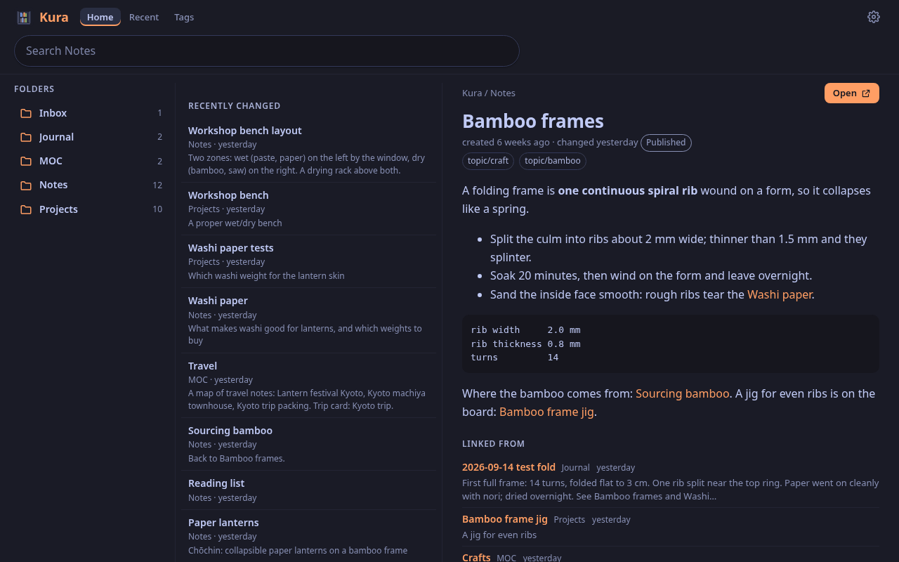
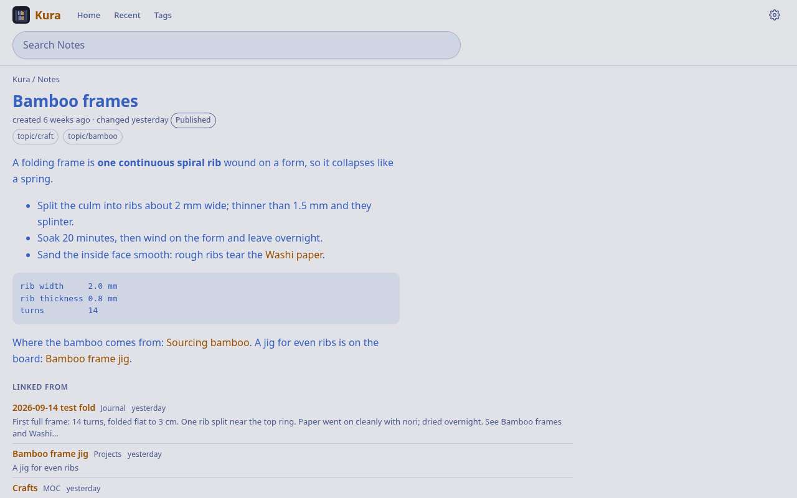
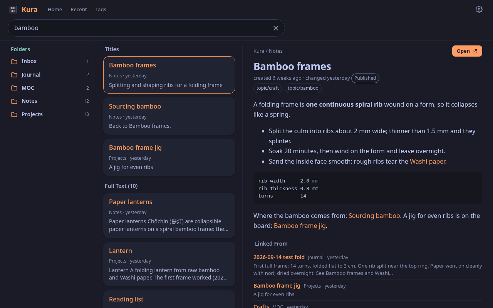
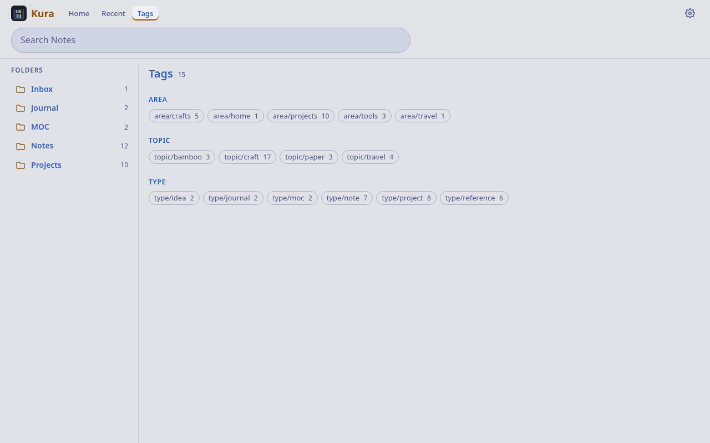
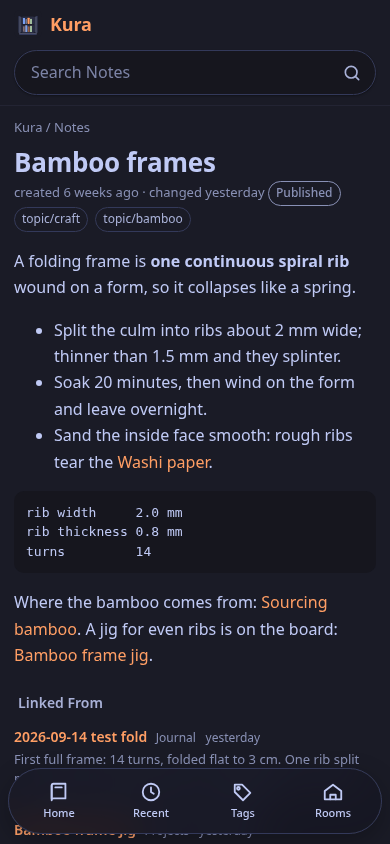

# Kura

Machiya is a set of small self-hosted apps for finding what you've read: your pages (Hister), the web (SearXNG), your notes (an Obsidian vault in git) and your code.

Kura (蔵, storehouse) is the Machiya app that reads your notes: every note in your Obsidian vault, with working links, full-text search and a JSON API.

<p><a href="docs/screenshots/kura-home-dark.png"></a></p>

<p>
  <a href="docs/screenshots/kura-note-light.png"></a>
  <a href="docs/screenshots/kura-search-dark.png"></a>
  <a href="docs/screenshots/kura-tags-light.png"></a>
  <a href="docs/screenshots/kura-note-phone-dark.png"></a>
</p>

- **Follow every link.** Every `[[wikilink]]` works, with backlinks from the whole vault, folders, tags (nested ones too) and recently changed.
- **Search everything.** SQLite FTS5: `"phrases"`, `-exclusions`, `prefix*`, `title:`, `tag:`, `folder:` and `vault:`, ranked by bm25 with titles first.
- **Read offline.** Install it as a PWA. The 200 notes you read last stay on the device for when you're off The Internet, and notes with `offline: true` stay for good. Nothing under `Archive/` is ever kept.
- **Keep work notes apart.** `KURA_VAULTS` adds more vaults (say `work` or `team`) at `/v/<name>/`, with a vault switch in the header. A vault is **private** unless marked `+shared`: a yellow chip, never pushed to Hister, never stored on a device, no external links, no feed. A **shared** vault works like the default one: kept offline, external links, its own `/v/<name>/feed.xml`, pushed to Hister. Neither gets Niwa or Konbini links (those apps read the default vault only), and API clients see either only when they ask with `vault=`. See "Vaults" in the API contract.
- **Feed the other apps.** Every note link in Machiya lands here. Shiori, the search app, reads its notes from the JSON API: `/api/search`, `/api/notes`, `/api/note` (with `external_links`: the note's http, https, Gemini and Gopher links), `/api/links` (a folder's external links in one call, never for a private vault), `/api/recent`, `/api/tags`, `/api/folders`, `/api/vaults`, `/api/offline`, `/api/status`, `/api/changelog`, plus `/feed.xml`. With `KURA_HISTER_URL`, every note goes into Hister too.

The [Machiya repository](https://github.com/machiya-kobo/machiya) has the architecture, the principles and the API contract (`docs/contracts/kura-api.md`).

## Quickstart

Kura alone on your own machine, reading the sample vault in `sample-vault/` (a made-up paper-lantern workshop and a trip
to Kyoto, 27 notes). No account, no Tailscale, no identity file. You need `git`, `curl` and Python 3.12 or later (the
image has 3.13). On Debian 13:

<!-- quickstart: quick-debian:packages -->
```bash
sudo apt-get update && sudo apt-get install -y git curl python3-venv
```

**1. Clone Kura:**

```sh
git clone https://github.com/machiya-kobo/kura.git && cd kura
```

**2. Install its two Python packages** (`markdown` 3.11 or later and `pyyaml`) in a virtual environment:

<!-- quickstart: quick:python -->
```bash
python3 -m venv .venv && .venv/bin/pip install -q 'markdown>=3.11' pyyaml
```

**3. Start it on the sample vault.** It listens on `127.0.0.1:8080` with the identity check off (`KURA_AUTH=open`: your
own machine only):

<!-- quickstart: quick:serve -->
```bash
KURA_AUTH=open KURA_BIND=127.0.0.1 KURA_PUBLIC_URL=http://127.0.0.1:8080 KURA_REPO_DIR="$PWD" KURA_REPO_SUBDIR=sample-vault/personal .venv/bin/python app/kura.py
```

**4. Open <http://127.0.0.1:8080/>** and search for `bamboo`, `title:kyoto` or `tag:topic/travel`. The API answers
too, from another terminal:

<!-- quickstart: quick:check -->
```bash
curl -s 'http://127.0.0.1:8080/api/search?q=title:bamboo' | grep '"path"'
```

<!-- quickstart-expect: quick:check -->
```text
   "path": "Projects/Bamboo frame jig.md",
   "path": "Notes/Sourcing bamboo.md",
   "path": "Notes/Bamboo frames.md",
```

Ctrl-C stops it. For your own vault, point `KURA_REPO_DIR` at its checkout (and `KURA_REPO_SUBDIR` at the notes folder,
if it isn't the top). `tools/quickstart-test` runs these steps from a fresh clone and checks the output.

## Who can use it

The vault's person is the **owner**. Who else gets in is up to you:

- **You, on localhost:** `KURA_AUTH=open` with `KURA_BIND=127.0.0.1`, as in the Quickstart. Kura then answers only to an
  IP address, `localhost`, `KURA_PUBLIC_URL`'s name and `KURA_ALLOWED_HOSTS`.
- **People on your tailnet:** listen on `127.0.0.1`, put `tailscale serve` in front and list their Tailscale logins in
  `KURA_USERS` (`KURA_AUTH=tailscale`, the default; `*` = anyone, unset = nobody).
- **People, agents, sign-in or Shiori devices:** Machiya's identity file. `cd app && python3 -m vaultkit.identity setup`
  (from the Quickstart's venv: `cd app && ../.venv/bin/python -m vaultkit.identity setup`; vaultkit lives in `app/`)
  prints the settings for each app. Off unless you set it; see [Machiya's identity guide](https://github.com/machiya-kobo/machiya/blob/main/docs/identity.md).
- **Hister's users as the sign-in:** `KURA_AUTH=hister` (off unless you set it; not with the identity file). Kura asks
  Machiya's sign-in helper (hister-login) whether you're signed in to Hister: one sign-in for Hister and every app, and
  signing out anywhere ends it. Signed out, a page goes to the helper's sign-in and an API call gets
  `401 {"error": "sign in", "signin": …}`. A Hister account that isn't in `KURA_HISTER_USERS` gets 403. With the helper
  or Hister unreachable, every page and call is a 503: **no Tailscale fallback**, no grace period. Each app keeps a
  host-only cookie of its own, from a one-time code the helper hands over (the shared cookie is on its way out). A
  caller that isn't a browser sends a room token (`Authorization: Bearer mht_…`, minted on the helper, good only for the
  apps it names) in place of Hister's own token. See [Machiya's identity guide](https://github.com/machiya-kobo/machiya/blob/main/docs/identity.md#hister-sign-in-authhister).
- **Always open:** `/api/status`, for monitoring, and `/api/changelog` (the first 64 KiB of [`app/CHANGELOG.md`](app/CHANGELOG.md), for the Machiya landing page's recent deploys).
- Kura's identity settings: `MACHIYA_IDENTITY_FILE`, `KURA_SIGNIN`, `KURA_AUTH_HEADER`, `KURA_BIND_BEHIND_PROXY`,
  `KURA_ACCEPT_APP_CAPS` and `KURA_PUBLIC_URL` (under Settings).

## More ways to run it

These start in a clone, like the Quickstart. Kura reads a git repository (or a folder in one), so each path turns a copy
of the sample vault into a repository of its own, as your vault would be.

### With a container (Docker or Podman)

Neither installed? On Debian 13, install `podman` (and `catatonit`, the small init that `--init` uses with podman):

<!-- quickstart: container-debian:packages -->
```bash
sudo apt-get update
sudo apt-get install -y git curl podman catatonit
```

Pick your engine (the rest of this section runs `$DOCKER`):

<!-- quickstart: container-docker:engine -->
```bash
DOCKER=docker
```

*or, with Podman* (`--cgroup-manager=cgroupfs` spares podman a systemd user session, which a fresh or ssh-only machine
may not have yet):

<!-- quickstart: container-podman:engine -->
```bash
DOCKER="podman --cgroup-manager=cgroupfs"
```

Then make the sample vault a repository and start Kura:

<!-- quickstart: container:vault -->
```bash
cp -R sample-vault/personal vault
git -C vault init -q -b main
git -C vault add -A
git -C vault -c user.name=Demo -c user.email=demo@example.com commit -q -m "sample vault"
```

<!-- quickstart: container:run -->
```bash
$DOCKER build -t kura app
$DOCKER run -d --init --name kura -p 127.0.0.1:8080:8080 \
  -v "$PWD/vault:/vault:ro" -v kura-data:/data \
  -e KURA_REPO_DIR=/vault -e KURA_AUTH=open \
  -e GIT_CONFIG_COUNT=1 -e GIT_CONFIG_KEY_0=safe.directory -e GIT_CONFIG_VALUE_0='*' \
  kura
```

The three `GIT_CONFIG_*` settings tell git that the mounted vault, owned by your user, is safe to read. `--init` makes
`stop` quick. Wait until Kura has read the vault, then check it:

<!-- quickstart: container:check -->
```bash
for i in $(seq 60); do curl -s http://127.0.0.1:8080/api/status | grep -q '"ready": true' && break; sleep 1; done
curl -s http://127.0.0.1:8080/api/status | grep -E '^ "(notes|ready|error)": '
curl -s 'http://127.0.0.1:8080/api/search?q=title:bamboo' | grep '"path"'
```

What you should see:

<!-- quickstart-expect: container:check -->
```text
 "notes": 27,
 "ready": true,
 "error": null,
   "path": "Projects/Bamboo frame jig.md",
   "path": "Notes/Sourcing bamboo.md",
   "path": "Notes/Bamboo frames.md",
```

Open <http://127.0.0.1:8080/>, as in the Quickstart. Stop it with:

<!-- quickstart: container:stop -->
```bash
$DOCKER rm -f kura
```

### Natively on the BSDs

On Linux or macOS, the Quickstart is the native install. On the BSDs, install the packages, clone Kura (Quickstart step
1) and run `app/kura.py` from the clone. Kura needs Python 3.12 or later (the image has 3.13), `markdown` 3.11 or later,
`pyyaml`, SQLite with FTS5 (every package below has it) and `git` (a fresh FreeBSD or OpenBSD has none; the lines below
include it). Every BSD's `markdown` package is older today (FreeBSD and OpenBSD 3.10.2, NetBSD 3.10.3), and Kura refuses
to start with one (it can run out of memory on one note under Python 3.13), so the packages leave it out and a virtual
environment gets it from pip. Run the package commands as root, or with `sudo`/`doas`. A fresh FreeBSD or NetBSD has
neither: run them as root without the `sudo`, or install `sudo` first.

**OpenBSD 7.9:**

<!-- quickstart: native-openbsd:packages -->
```bash
doas pkg_add python%3 py3-yaml git curl
```

<!-- quickstart: native-openbsd:python -->
```bash
PY=python3
```

**FreeBSD 14 or 15** (`py312-sqlite3` is separate there):

<!-- quickstart: native-freebsd:packages -->
```bash
sudo pkg install -y python312 py312-sqlite3 py312-pyyaml git-lite curl
```

<!-- quickstart: native-freebsd:python -->
```bash
PY=python3.12
```

**NetBSD 10 or 11** (a fresh NetBSD has no `pkgin`; `pkg_add` reads the binary packages from `PKG_PATH`):

<!-- quickstart: native-netbsd:packages -->
```bash
PKG_PATH="https://cdn.netbsd.org/pub/pkgsrc/packages/NetBSD/$(uname -p)/$(uname -r | cut -d_ -f1)/All"
sudo env PKG_PATH="$PKG_PATH" /usr/sbin/pkg_add python313 py313-yaml git-base curl
```

<!-- quickstart: native-netbsd:python -->
```bash
PATH=/usr/pkg/bin:$PATH
PY=python3.13
```

Then, in the clone, get `markdown` from pip in a virtual environment that also sees the packages you just installed
(`$PY` becomes its Python):

<!-- quickstart: native:venv -->
```bash
$PY -m venv --system-site-packages .venv && .venv/bin/pip install -q 'markdown>=3.11'
PY=.venv/bin/python
```

Then make the sample vault a repository and start Kura:

<!-- quickstart: native:vault -->
```bash
cp -R sample-vault/personal vault
git -C vault init -q -b main
git -C vault add -A
git -C vault -c user.name=Demo -c user.email=demo@example.com commit -q -m "sample vault"
```

<!-- quickstart: native:run -->
```bash
mkdir -p data
KURA_AUTH=open KURA_BIND=127.0.0.1 KURA_PUBLIC_URL=http://127.0.0.1:8080 \
  KURA_REPO_DIR="$PWD/vault" KURA_DB="$PWD/data/kura.sqlite3" $PY app/kura.py > data/kura.log 2>&1 &
echo $! > data/kura.pid
```

<!-- quickstart: native:check -->
```bash
for i in $(seq 60); do curl -s http://127.0.0.1:8080/api/status | grep -q '"ready": true' && break; sleep 1; done
curl -s http://127.0.0.1:8080/api/status | grep -E '^ "(notes|ready|error)": '
curl -s 'http://127.0.0.1:8080/api/search?q=title:bamboo' | grep '"path"'
```

The output matches the container's:

<!-- quickstart-expect: native:check -->
```text
 "notes": 27,
 "ready": true,
 "error": null,
   "path": "Projects/Bamboo frame jig.md",
   "path": "Notes/Sourcing bamboo.md",
   "path": "Notes/Bamboo frames.md",
```

Stop it with:

<!-- quickstart: native:stop -->
```bash
kill "$(cat data/kura.pid)"
```

[`docs/install/bsd.md`](https://github.com/machiya-kobo/machiya/blob/main/docs/install/bsd.md) in the Machiya repository
turns the native install into a service (rc.d scripts, a user of its own, `tailscale serve` in front).

`tools/quickstart-test` runs exactly these commands from a fresh clone and checks the output shown, so the README and the
test can't drift. `--dry-run` lists the steps; `--ssh HOST` runs them on a clean BSD or Debian machine.

### As part of the Machiya stack

Machiya is several small apps around one vault. Each app is a **room** (Kura is the one that reads and searches every
note), and the rooms share one look and one set of settings. To run Kura with the others, clone `machiya`, `kura`,
`niwa` and `konbini` side by side and follow the [Quickstart in the Machiya repository's README](https://github.com/machiya-kobo/machiya#quickstart):
`compose/demo-init` prepares the sample vault and a `.env`, and `docker compose up -d --build` brings up the whole stack
(Hister and SearXNG for search, Kura, Niwa, Konbini). `demo-init --mirror` keeps one copy of the vault for all of them
(`compose/mirror.yml`). The stack's own settings are in its compose files and `.env.example`. What changes for Kura:

- **The port:** the stack publishes Kura on `127.0.0.1:8083` (`KURA_PORT`), not 8080.
- **The vault** comes from the stack's `VAULT_REPO_URL` (Kura clones it) or, with the shared copy, from a read-only
  checkout at `/vault` (`KURA_REPO_DIR=/vault`, no `KURA_REPO_URL`). `VAULT_SUBDIR` (`KURA_REPO_SUBDIR`) names the notes
  folder: `personal` in the sample vault.
- **The other rooms:** `MACHIYA_ROOMS` (the Rooms switcher in the header), `KURA_NIWA_URL` and `KURA_KONBINI_URL`
  ("View in Niwa" and "View Card in Konbini"), and `KURA_HISTER_URL` (push every note into Hister; once Hister has
  sign-in on, also `KURA_HISTER_TOKEN_FILE`, the owner's Hister token, which the reference compose doesn't pass yet).
- **Who may read it:** the stack's compose sets `KURA_AUTH=open`, safe only because every published port binds
  `127.0.0.1`. "Who can use it" says how to let others in.
- **One look across rooms:** with the rooms on hostnames of one domain, `MACHIYA_COOKIE_DOMAIN` shares the theme and
  text size between them.
- **Links:** `KURA_PUBLIC_URL` (the base of every note's URL), `MACHIYA_SOURCE_URL` (a source-code link in the footer)
  and `KURA_SHIORI_LINKS=1` ("Save links in Shiori").

## How it reads the vault

Kura keeps its own clone of the vault repo (https, ssh or file) and fetches it every `KURA_POLL` seconds. It rebuilds its in-memory index whenever the commit changes; a few hundred notes take under a second. With `KURA_HISTER_URL` it pushes every note into Hister (label `vault`, each under its Kura URL) and remembers what it sent in `KURA_DB`. That and your preferences (theme and text size, in `prefs.sqlite3` next to it) are its only state: lose `/data` and Kura clones again, re-sends every note once and forgets the preferences. Niwa, Konbini and Hister are optional. Kura never writes to the vault.

## Settings

The `/settings` page has Appearance, Reading (Preview Pane, Obsidian Vault, Offline Copies), Rooms and About. Everything else is the environment:

| Env | Default | |
|---|---|---|
| `KURA_VAULTS` | — | `name[+shared][:Title]=source#subdir,…`: the vaults; the first is the default (`/n/…`), the rest live at `/v/<name>/…` and are private unless marked `+shared` (not allowed on the default, which is never private; any other `+flag` refuses to start). `source` is a directory (a mounted checkout) or a git URL (cloned once per distinct URL under `KURA_REPO_DIR`). Example: `personal=/vault#personal,team+shared:Team=/vault#team,work:Work=/vault#work`. Names are `[a-z0-9-]+`, not `v`. Unset: the `KURA_REPO_*` below describe one vault, `notes` |
| `KURA_VAULT_<NAME>_OBSIDIAN` | the folder name | that vault's name in Obsidian (`/api/vaults` reports it as `obsidian`) |
| `KURA_REPO_URL` | — | vault repo. Unset: use `KURA_REPO_DIR` as it is (a mounted checkout) |
| `KURA_REPO_DIR` | `/data/repo` | the clone |
| `KURA_REPO_SUBDIR` | — (the repo root) | the vault folder in the repo |
| `KURA_REPO_BRANCH` | remote default | |
| `KURA_REPO_TOKEN_FILE`, `KURA_REPO_USER` | — | https token (a file) and its user; sent as a header through git's environment, never in a URL or `.git/config` |
| `KURA_POLL` | `60` | seconds between fetches (min 10) |
| `KURA_USERS` | — | allowed `Tailscale-User-Login`s, comma-separated; `*` = anyone; unset = nobody. `/api/status` is always open, without the repo URL, the folder and error details (those need the owner gate) |
| `KURA_AUTH` | `tailscale` | `tailscale` = the `KURA_USERS` allow-list; `open` = no identity check (a startup warning; the log names everyone `local`), only for localhost or a trusted LAN; it answers only to an IP address, `localhost`, `KURA_PUBLIC_URL`'s name and `KURA_ALLOWED_HOSTS` in `Host` (DNS rebinding); `hister` = Hister's users are the sign-in (below, no identity file); `header` = a trusted proxy's login header (with an identity file, `KURA_AUTH_HEADER`). Anything else refuses to start |
| `KURA_AUTH=hister` | — | Hister's users are the sign-in (above). Needs `KURA_AUTH_URL` (the helper's internal address, `http://hister-login:8081`), `KURA_AUTH_SIGNIN_URL` (its public sign-in page), `KURA_HISTER_USERS` (the owner's Hister username, comma-separated, never `*`) and `KURA_PUBLIC_URL`; refuses to start without them or with an identity file. `KURA_AUTH_FALLBACK` may only be `none` (the default). `MACHIYA_COOKIE_DOMAIN` is the shared sign-in cookie's domain and `MACHIYA_SSO_COOKIE` its name. Preferences are kept per Hister user, so they start empty once |
| `MACHIYA_IDENTITY_FILE` | — | Machiya's identity file (vaultkit's `identity`; [Machiya's `docs/identity.md`](https://github.com/machiya-kobo/machiya/blob/main/docs/identity.md)): people, agents and services with grants. Set, it replaces `KURA_USERS`: a principal needs the `kura` `read` grant, and reads only the vaults its grant allows (`"default"`, `"shared"` or names; agents get the default and shared vaults by default, never a private one unless named). A vault it may not read answers like one that doesn't exist. `/api/status`'s full view is the owner's. Mount the file's directory read-only |
| `KURA_AUTH_HEADER` | — | with an identity file and `KURA_AUTH=header`: the trusted proxy's login header (`Remote-User`, …) |
| `KURA_BIND_BEHIND_PROXY` | — | `1`: `KURA_AUTH=tailscale` (with or without an identity file) or `header` may bind a non-loopback address because a proxy (the Tailscale sidecar) is the only way in. Without it Kura refuses to start on anything but 127.0.0.1, since anyone who can reach the port could forge the login header |
| `KURA_ACCEPT_APP_CAPS` | — | `1`: read Tailscale's forwarded app capability (`Tailscale-App-Capabilities`) for tagged nodes. Only where Serve forwards it (`--accept-app-caps`, Tailscale v1.92+): an older Serve passes a client's own copy through |
| `KURA_SIGNIN` | — | `1`: with an identity file, Kura's built-in sign-in (a person's name and password from the identity file, no Tailscale or proxy needed). `GET`/`POST /signin` and `POST /signout` (same-origin form posts), and a browser page without a session answers 401 with a link to `/signin?next=<page>`; Settings shows Sign Out to a signed-in browser. The session is the `machiya_session` cookie (`Secure` unless `KURA_PUBLIC_URL` is `http://`; shared across rooms with `MACHIYA_COOKIE_DOMAIN`). **Over plain http set `KURA_PUBLIC_URL=http://<address>`**: the same-origin check then accepts only that origin; without it Kura accepts only an https page whose `Host` is its own, so over http every sign-in is refused (a startup line says so) |
| *(routes)* | — | with an identity file, whether or not `KURA_SIGNIN` is on: `POST /api/pair` (Shiori trades a one-time code from the identity CLI's `pair` for a device token; no cookie, before the gate) and `GET`/`PUT /api/prefs` (the caller's own preferences, `{"prefs": {key: value}}`; needs the `kura` `read` grant; a `PUT` made with a cookie must be same-origin, one with a token needn't). Kura's only other methods are `GET` and `HEAD`: any other `POST` or `PUT` is 405. Without an identity file `/api/pair` is 404, and `/api/prefs` serves the one person the `KURA_USERS` gate admits (or open mode's owner), keyed by a hash of the Tailscale login, never the login itself; in open mode over plain http without `KURA_PUBLIC_URL`, a `PUT` from the page's own (allowed) `Host` counts as same-origin |
| `KURA_ALLOWED_HOSTS` | — | with `KURA_AUTH=open`: more names Kura answers to in `Host`, comma-separated (case, a port and a trailing dot don't matter). A request with any other name, or none (an HTTP/1.0 client), gets 403 |
| `KURA_BIND` | `0.0.0.0` | the listening address. Behind `tailscale serve` on a native install, `127.0.0.1`, so nothing reaches Kura around it |
| `KURA_ENV_FILE` | — | a `KEY=VALUE` file read before every other setting (or `--env-file PATH`); the real environment wins. For rc.d, which can't set a daemon's environment |
| `KURA_PUBLIC_URL` | `https://<Host>` | base for URLs in API answers and the feed: an origin only (`https://kura.example`), never a path, since clients tell a work vault's note by `/v/` at the start of its path. Anything else refuses to start |
| `KURA_NIWA_URL`, `KURA_KONBINI_URL` | — | sister links: "View in Niwa", "View Card in Konbini" (and the Rooms switcher when `MACHIYA_ROOMS` is unset) |
| `MACHIYA_ROOMS` | — | the Rooms switcher: `shiori=https://…,konbini=…,niwa=…,kura=…,hister=…,searxng=…` (the stack sets it); also Search's "Search everything in Shiori" |
| `MACHIYA_COOKIE_DOMAIN` | — | share Theme, Text Size and Apps across the rooms on this domain (e.g. `example.ts.net`) |
| `KURA_AUTH_ACCEPT_ORIGINS` | — | with `KURA_AUTH=hister`: other origins whose room sessions Kura also accepts, comma-separated `scheme://host[:port]` (Shiori's hosted pages, whose nginx passes their own room cookie on to Kura). Every check names the room, so a session from an origin not listed here is refused |
| `MACHIYA_SSO_COOKIE` | `machiya_sso` | with `KURA_AUTH=hister`: the sign-in cookie's name (letters, digits, `_` and `-`). A second stack on the same cookie domain (a dev stack) sets its own; the rooms, the landing page and hister-login must agree |
| `MACHIYA_SOURCE_URL` | — | a "Source" link in the footer to where this Kura's code is published (AGPL §13) |
| `KURA_SHIORI_LINKS` | — | `1`: a note with external links shows "Save links in Shiori" (`shiori://save-links?path=<vault path>`), default vault only. Off, nothing changes |
| `KURA_HISTER_URL` | — | push every note of the default and the shared vaults into Hister (label `vault`); a vault made private again is withdrawn; needs `KURA_PUBLIC_URL`. At start and then daily Kura checks that Hister still holds what it sent and sends the missing ones again (`push.missing` in `/api/status` counts what is still gone after that, `push.restored` what was sent again) |
| `KURA_HISTER_TOKEN_FILE` | — | a file holding the owner's Hister token, sent as `X-Access-Token` on every call to Hister (add, delete). Read on each call, so a regenerated token needs no restart; set but empty or unreadable, the push waits and retries instead of sending without it. Never logged. Unset: no token, as before. The token is a secret: keep the file out of the repository (`chmod 600`) |
| `KURA_DB` | `/data/kura.sqlite3` | what the push sent (URL + hash per note). Preferences (`/api/prefs`) live in `prefs.sqlite3` in the same folder (0600, made on first use), so deleting `KURA_DB` to re-send everything to Hister keeps them |
| `KURA_PORT` | `8080` | |
| `TZ` | the system zone (UTC in the image) | the day "changed yesterday" is counted in |

## Install (your own vault)

Kura needs nothing else from Machiya: Python 3.12 or later (the image has 3.13), `markdown` 3.11 or later, `pyyaml` and `git`, or the Docker image. It serves a git repository (or a checkout) that holds an Obsidian vault.

**Docker, standalone** (clones the vault itself and keeps its state in `/data`):

```sh
docker build -t kura app
docker run --init -p 127.0.0.1:8080:8080 -v kura-data:/data \
  -v "$PWD/token:/run/secrets/token:ro" \
  -e KURA_REPO_URL=https://example.com/you/vault.git -e KURA_REPO_TOKEN_FILE=/run/secrets/token \
  -e KURA_AUTH=open kura
```

`token` is a file holding the git host's access token. Drop the `-v` and `KURA_REPO_TOKEN_FILE` lines for a public repository; `ssh://` and `file://` URLs work too. `KURA_AUTH=open` turns the identity check off: anyone who can reach port 8080 reads every note, so the port is published on `127.0.0.1` only. Open http://127.0.0.1:8080/. To let others in, see "Who can use it".

**Native, on a checkout you already have** (read-only, no clone):

```sh
python3 -m venv .venv && .venv/bin/pip install 'markdown>=3.11' pyyaml
mkdir -p data
KURA_AUTH=open KURA_BIND=127.0.0.1 KURA_REPO_DIR=/path/to/vault KURA_DB="$PWD/data/kura.sqlite3" .venv/bin/python app/kura.py
```

**Behind `tailscale serve`:** Kura trusts the `Tailscale-User-Login` header it sets, so listen on `127.0.0.1` (`KURA_BIND`) and block the port from outside.

**More:** native installs on the BSDs (packages only, rc.d scripts, an env file for the settings) are in [`docs/install/bsd.md`](https://github.com/machiya-kobo/machiya/blob/main/docs/install/bsd.md) in the Machiya repository. Running Kura with the other apps is its [Quickstart](https://github.com/machiya-kobo/machiya#quickstart), and the vault's own layout (frontmatter, tags, folders) is [`docs/frontmatter.md`](https://github.com/machiya-kobo/machiya/blob/main/docs/frontmatter.md).

## Layout

- `app/kura.py`: the server: settings, the sync loop, routes, the owner gate and the API
- `app/pages.py`: the reader pages; every page takes the vault (`g`, a `sites.Site`) and builds its links with `g.prefix`
- `app/sites.py`: the vaults: `KURA_VAULTS` parsing, `Site` (a vaultkit `Vault` with a name, title, prefix, and whether it's shared or private) and the shared checkouts
- `app/search.py`: the FTS5 index (one table, a `vault` column) and the query syntax
- `app/api.py`: JSON shapes, card links, the HTML sanitizer for `/api/note`, and RSS
- `app/push.py`: the vault push into Hister
- `app/shell.py`: Kura's room on the shared shell (`vaultkit.shell`): tabs, glyphs, the manifest, the service worker's settings, `/settings`
- `app/static/`: `kura.css` (the reader's own layout, over `machiya.css`) and `kura.js` (preview pane, Mermaid, Edit in Obsidian, the offline banner), vendored Mermaid (MIT), icons
- `app/vaultkit/`: the shared vault core and UI (`ui/machiya.css`, `machiya.js`, `machiya-sw.js`), **vendored** from machiya-kobo/machiya (`tools/vendor-vaultkit <tag>`)
- `tests/`: `python3 -m unittest discover -s tests` (see CLAUDE.md, "Testing"); `CONTRIBUTING.md` says how to send a change
- `tools/screenshots`: retakes the README's screenshots from the sample vault
- `skills/kura/`: a short agent skill for finding and reading notes through the API

## Licence

Copyright (C) 2026 Micheal Waltz and Machiya contributors.

Kura is free software: GNU Affero General Public License, version 3 or (at your option) any later version.
See `LICENSE`. Third-party software it ships or installs (Mermaid, Python Markdown, PyYAML) is listed with its
licences in `THIRD_PARTY_NOTICES`.
